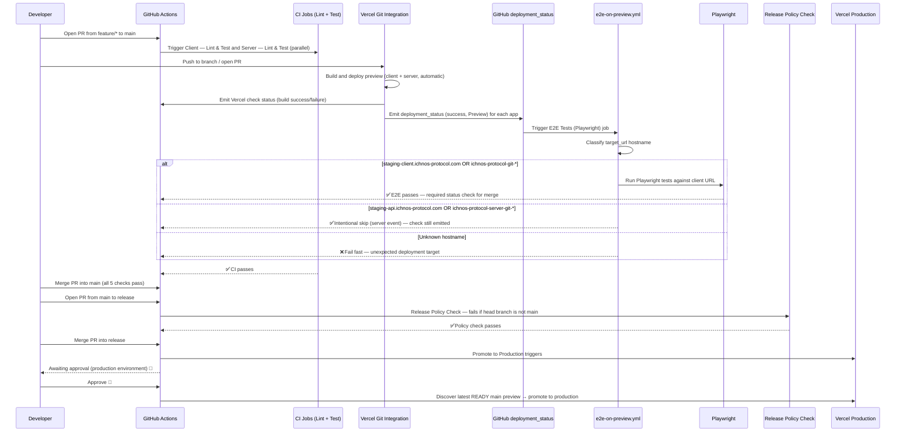

# GitHub Actions Deployment Pipeline

This repository uses a **2-branch deployment model**: `feature/* → main → release`. No code reaches Vercel production without passing CI, E2E tests, and a human approval gate. Preview deployments are handled by **Vercel's native Git integration** — every push to a branch or PR automatically creates a preview deployment without any GitHub Actions workflow involvement. E2E tests run on every PR targeting `main`, and merge is blocked until all required checks pass.

## 1. Pipeline Overview

## 2. Workflows

| Workflow file | Name | Trigger | Purpose |
|---|---|---|---|
| `ci.yml` | CI | `pull_request` to `main` | Lint + unit tests + client build verification |
| `e2e-on-preview.yml` | E2E Tests on Preview | `deployment_status` | Run E2E for client hostnames (custom domain + auto-preview URL); skip server hostnames; fail-fast unknown hostname |
| `promote-to-production.yml` | Promote to Production | `push` to `release` | Discover latest READY `main` preview → promote to production (approval-gated) |
| `release-policy-check.yml` | Release Policy Check | `pull_request` to `release` | Fails if PR head branch is not `main` |
| `vercel-promote-production.yml` | Promote Vercel Preview to Production | `workflow_dispatch` (manual) | Emergency/manual promotion via explicit deployment URL inputs |
| `e2e.yml` | E2E Tests (Playwright) | `workflow_dispatch` (manual) | Ad-hoc Playwright diagnostics against a provided `base_url` |

> **Note:** Preview deployments are **not** managed by any GitHub Actions workflow. They are created automatically by Vercel's native Git integration whenever code is pushed to a branch or a PR is opened. There is no `vercel-preview-on-main.yml` workflow.

## 3. E2E Hostname-Based Target Detection

E2E tests are triggered by **GitHub `deployment_status` events** via `e2e-on-preview.yml`. When Vercel's native Git integration completes a Preview deployment, GitHub emits a `deployment_status` event containing a `target_url`. The workflow classifies this URL by hostname to decide what action to take:

Two detection families are used — custom domains and Vercel auto-preview URLs:

| Hostname pattern in `target_url` | Type | Action | Rationale |
|---|---|---|---|
| `staging-client.ichnos-protocol.com` | Custom domain | Run Playwright tests | Client deployment — the E2E target |
| `ichnos-protocol-git-*` (excluding `ichnos-protocol-server-git-*`) | Auto-preview URL | Run Playwright tests | Client feature-branch preview — E2E target |
| `staging-api.ichnos-protocol.com` | Custom domain | Intentional skip (job succeeds without running tests) | Server deployment — no browser tests needed |
| `ichnos-protocol-server-git-*` | Auto-preview URL | Intentional skip (job succeeds without running tests) | Server feature-branch preview — no browser tests needed |
| Any other hostname | — | Fail fast (`exit 1`) | Unexpected deployment — flag for investigation |

**Key details:**

- Detection uses `deployment_status.target_url` hostname pattern matching, **not** `VERCEL_PROJECT_ID_CLIENT` or any other secret. Hostname routing is the source of truth for E2E target classification.
- The server auto-preview pattern (`ichnos-protocol-server-git-*`) is checked **before** the client auto-preview pattern (`ichnos-protocol-git-*`) to prevent false positives, since the server pattern is a subset of the client pattern.
- Both client and server Preview deployments emit the `E2E Tests (Playwright)` check context. The server path succeeds immediately without executing tests — this is intentional so the required status check is satisfied for both deployment events.
- The job-level `if` condition filters on `deployment_status.state == 'success'` and `deployment.environment == 'Preview'` before hostname classification occurs.

## 4. E2E Troubleshooting

When investigating E2E check results, use this table to interpret the status:

| Check Status | Meaning | Action |
|---|---|---|
| **Passed** (client hostname) | Playwright tests executed and passed | No action needed |
| **Skipped** (server hostname) | Server deployment event (`staging-api.ichnos-protocol.com` or `ichnos-protocol-server-git-*`); tests intentionally skipped | No action needed — this is expected behavior |
| **Failed** — "unknown deployment target pattern" | Hostname in `target_url` did not match any expected pattern (custom domains or auto-preview URL patterns) | Check if Vercel domain or project naming changed; verify `target_url` and extracted hostname in the workflow run logs |
| **Failed** — Playwright test failure | Tests executed against the client deployment and failed | Check the Playwright HTML report artifact uploaded to the workflow run |
| **Cancelled** | Workflow run was cancelled mid-execution | Re-run the workflow or push a new commit to trigger a fresh deployment |

**First debugging step:** Open the **Job summary** tab in the GitHub Actions run for `e2e-on-preview.yml`. It shows `target_url`, hostname classification result, and step outcomes in a compact table.

## 5. One-Time Setup — GitHub

Full GitHub repository settings — secrets, environments, branch protections, auto-merge, and fork policy — are documented in [`GITHUB_SETTINGS.md`](GITHUB_SETTINGS.md). Follow that guide from top to bottom for initial setup or to verify an existing configuration.

### Required secrets summary

Kept here for quick reference. [`GITHUB_SETTINGS.md`](GITHUB_SETTINGS.md) is the authoritative source.

#### CI and E2E secrets (10)

| Secret | Purpose |
|---|---|
| `DATABASE_URL` | PostgreSQL connection string for E2E seed |
| `E2E_ADMIN_EMAIL` / `E2E_ADMIN_PASSWORD` / `E2E_ADMIN_UID` | Admin test account |
| `E2E_USER_EMAIL` / `E2E_USER_PASSWORD` / `E2E_USER_UID` | Regular user test account |
| `E2E_SUPER_ADMIN_EMAIL` / `E2E_SUPER_ADMIN_PASSWORD` / `E2E_SUPER_ADMIN_UID` | Super-admin test account |

These secrets are sufficient for CI, E2E, and preview deployments. Preview deployments are handled entirely by Vercel's native Git integration — no Vercel API tokens or project IDs are needed.

#### Production promotion secrets (4)

| Secret | Purpose |
|---|---|
| `VERCEL_TOKEN` | Vercel API token — used by `promote-to-production.yml` and `vercel-promote-production.yml` |
| `VERCEL_ORG_ID` | Vercel team/org ID — used by both promotion workflows |
| `VERCEL_PROJECT_ID_CLIENT` | Vercel project ID for the client app — used by both promotion workflows |
| `VERCEL_PROJECT_ID_SERVER` | Vercel project ID for the server app — used by both promotion workflows |

These 4 secrets are **required** for production promotion via GitHub Actions. Without them, merging into `release` will trigger `promote-to-production.yml` which will fail. If you prefer to promote manually via the Vercel dashboard, you can omit these secrets.

### Required checks per branch

| Target branch | Required status checks |
|---|---|
| `main` | `Client — Lint & Test`, `Server — Lint & Test`, `<your-client-vercel-check>`, `<your-server-vercel-check>`, `E2E Tests (Playwright)` |
| `release` | `Release Policy Check` + require a pull request before merging |

> **Note:** The `E2E Tests (Playwright)` check name is produced by `e2e-on-preview.yml` (job name: `E2E Tests (Playwright)`). The Vercel checks are produced by Vercel's native Git integration — **their exact names depend on your Vercel project names** (e.g., `Vercel – ichnos-protocol`, `Vercel – ichnos-protocol-server`). To find the correct names: open a recent PR, scroll to the status checks section, and copy the exact Vercel check context strings. A mismatch between the configured required check name and the actual check context will block all merges. GitHub Actions check names are frozen in workflow file headers — do not rename jobs without updating branch protection rules. See [`GITHUB_SETTINGS.md`](GITHUB_SETTINGS.md) §4 for step-by-step configuration.

## 6. One-Time Setup — Vercel

Full Vercel project settings — production branch, environment variables, old alias cleanup, and token/ID lookup — are documented in [`VERCEL_SETTINGS.md`](VERCEL_SETTINGS.md). Follow that guide for both `ichnos-client` and `ichnos-server`.

Two critical invariants to maintain:

- **Vercel production branch must be `release`** on both projects (not `main`).
- **Vercel Git integration must remain enabled** — preview deployments are created automatically on branch pushes and PRs. This is the default Vercel behavior; do not add `"git": { "deploymentEnabled": false }` to `vercel.json` files.

## 7. Daily Developer Workflow

### Feature → main (PR-gated)

| Step | Action | Status |
|---|---|---|
| 1 | Create `feature/<name>` from `main`; open PR targeting `main` | 🔴 Manual |
| 2 | CI runs: lint + test + build (client and server) | ✅ Automated |
| 3 | Vercel automatically creates preview deployments for both client and server | ✅ Automated (native Git integration) |
| 4 | Vercel emits `deployment_status` events; `e2e-on-preview.yml` runs `E2E Tests (Playwright)` for each | ✅ Automated |
| 5 | All 5 required checks pass — PR is mergeable | ✅ Automated gate |
| 6 | Merge PR into `main` | 🔴 Manual |

### main → release (production promotion)

| Step | Action | Status |
|---|---|---|
| 7 | Open PR from `main` to `release` | 🔴 Manual |
| 8 | `Release Policy Check` runs — fails if head branch is not `main` | ✅ Automated gate |
| 9 | Merge PR into `release` | 🔴 Manual |
| 10 | `Promote to Production` triggers; GitHub pauses for `production` environment approval | ✅ Automated trigger / 🔴 Manual approval |
| 11 | Approve → workflow discovers latest READY `main` preview and promotes it to production | 🔴 Manual approval → ✅ Automated |

## 8. Vercel Quota Protection

Preview deployments are managed by Vercel's native Git integration, which builds on every push. E2E tests run against the preview URL emitted by Vercel's `deployment_status` event, so no extra Vercel build is triggered for testing.

Fork PRs do not receive preview deployments with secrets because Vercel's Git integration does not expose environment variables to builds from forks by default.

## 9. Rollback

### Option A — Revert through the pipeline

Revert the bad commit on `main`, open a new `main → release` PR, and promote through the normal pipeline.

### Option B — Use the fallback `vercel-promote-production.yml` (manual)

1. Go to **GitHub → Actions → Promote Vercel Preview to Production → Run workflow**.
2. Enter the explicit `client_deployment_url` and `server_deployment_url` (deployment URL or ID from Vercel dashboard) of the last known-good deployment.
3. Run. Approval gate still applies.

This is the safest rollback path when you know the exact deployment ID of the last good version.

### Option C — Via Vercel dashboard

1. Open **Vercel Dashboard → Project → Deployments**.
2. Find the previous production deployment.
3. Click **Promote to Production** directly in the UI.

Repeat for both `ichnos-client` and `ichnos-server`. No GitHub Actions run is required.
