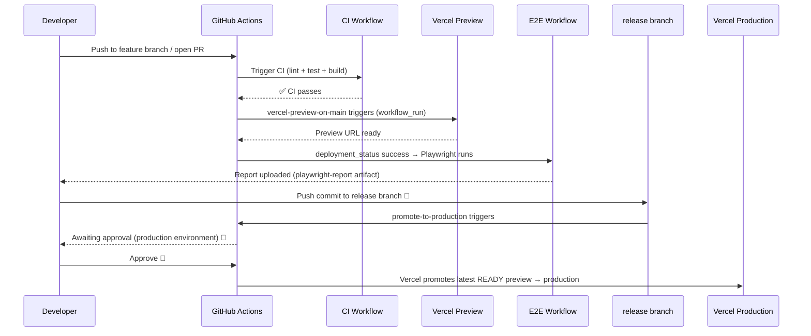

# GitHub Actions Deployment Pipeline

This repository uses a 3-stage deployment pipeline: **CI gate → preview → production**. No code reaches Vercel unless CI passes, and no code reaches production without a human approval on the `release` branch.

## 1. Pipeline Overview

## 2. Workflows

| Workflow file | Name | Trigger | Purpose | Gate / Condition |
|---|---|---|---|---|
| `ci.yml` | CI | `push` to `main`; `pull_request` targeting `main` | Lint, test, build for `client/` and `server/` | None — always runs |
| `vercel-preview-on-main.yml` | Vercel Preview on Main | `workflow_run` on CI completed, branch `main` | Deploy both apps to Vercel preview | Only runs if CI concluded `success` |
| `e2e.yml` | E2E Tests (Playwright) | `deployment_status` event | Run Playwright against the preview URL | Only runs if deployment state is `success` and URL matches client pattern |
| `promote-to-production.yml` | Promote to Production | `push` to `release` branch | Auto-fetch latest READY preview for `main` via Vercel API and promote to production | Requires human approval via GitHub `production` environment |
| `vercel-promote-production.yml` | Promote Vercel Preview to Production | `workflow_dispatch` (manual) | Emergency/manual promotion using explicit deployment URL or ID as input | Requires human approval via GitHub `production` environment |

## 3. One-Time Setup — GitHub

### 3.1 Create the `production` environment

1. Go to **GitHub repository → Settings → Environments → New environment**.
2. Name it exactly `production`.
3. Under **Deployment protection rules**, enable **Required reviewers** and add at least one reviewer.
4. Save.

> Both `promote-to-production.yml` and `vercel-promote-production.yml` target `environment: production`. Without this environment, promotions run without approval.

### 3.2 Required repository secrets

Navigate to **Settings → Secrets and variables → Actions → New repository secret** and add:

| Secret | Description |
|---|---|
| `VERCEL_TOKEN` | Personal or team token from Vercel |
| `VERCEL_ORG_ID` | Vercel team/org ID (Team Settings → General → Team ID) |
| `VERCEL_PROJECT_ID_CLIENT` | Project ID for `ichnos-client` (Project → Settings → General) |
| `VERCEL_PROJECT_ID_SERVER` | Project ID for `ichnos-server` (Project → Settings → General) |
| `DATABASE_URL` | PostgreSQL connection string (used by E2E seed step) |
| `E2E_ADMIN_EMAIL` | Admin test account email |
| `E2E_ADMIN_PASSWORD` | Admin test account password |
| `E2E_ADMIN_UID` | Admin test account Firebase UID |
| `E2E_USER_EMAIL` | Regular user test account email |
| `E2E_USER_PASSWORD` | Regular user test account password |
| `E2E_USER_UID` | Regular user test account Firebase UID |
| `E2E_SUPER_ADMIN_EMAIL` | Super-admin test account email |
| `E2E_SUPER_ADMIN_PASSWORD` | Super-admin test account password |
| `E2E_SUPER_ADMIN_UID` | Super-admin test account Firebase UID |

### 3.3 Optional: branch protection on `main`

In **Settings → Branches → Add rule** for `main`:
- Enable **Require status checks to pass before merging**.
- Add `Client — Lint & Test` and `Server — Lint & Test` as required checks.
- This prevents merging PRs with failing CI.

## 4. One-Time Setup — Vercel

For **both** `ichnos-client` and `ichnos-server` Vercel projects:

1. Open **Vercel Dashboard → Project → Settings → Git**.
2. Change **Production Branch** from `main` to `release`.
3. Save.

**Why:** Vercel treats the production branch specially — pushes to it create production deployments directly. By switching to `release`, pushes to `main` only ever create preview deployments. Production is updated exclusively via explicit promotion through `promote-to-production.yml`, which calls `vercel promote` against an already-built, already-tested preview artifact. No rebuild occurs at promotion time.

## 5. Daily Developer Workflow

| Step | Action | Status |
|---|---|---|
| 1 | Create a feature branch from `main` and open a PR | 🔴 Manual |
| 2 | CI runs automatically: lint + test + build for client and server — must be green before merge | ✅ Automated |
| 3 | Merge PR into `main` | 🔴 Manual |
| 4 | CI reruns on `main`; if it passes, `vercel-preview-on-main.yml` deploys both apps to Vercel preview | ✅ Automated |
| 5 | Vercel fires a `deployment_status` event; `e2e.yml` runs Playwright against the preview URL | ✅ Automated |
| 6 | Review the Playwright report (uploaded as `playwright-report` artifact) and the preview URL | 🔴 Manual |
| 7 | Ready to ship? Push a commit (or merge) into the `release` branch | 🔴 Manual |
| 8 | `promote-to-production.yml` triggers; GitHub pauses and waits for approval from a required reviewer | ✅ Automated trigger / 🔴 Manual approval |
| 9 | Approve in GitHub → Vercel promotes the latest READY preview (from `main`) to production — no rebuild | 🔴 Manual approval → ✅ Automated promotion |

> **Important:** Step 7 promotes whatever is the latest READY preview deployment on the `main` branch. Ensure E2E passed (step 5–6) before pushing to `release`.

## 6. Vercel Quota Protection

**Before this change:** `vercel-preview-on-main.yml` triggered directly on `push` to `main`. Every push — including pushes with broken tests, lint errors, or a failing Vite build — consumed a Vercel deployment slot.

**After this change:** `vercel-preview-on-main.yml` uses `workflow_run` and only runs when CI concludes `success`. A push that fails lint, tests, or the client build never reaches Vercel. Zero deployments are wasted on broken code.

Additionally, E2E tests run against the preview URL rather than a separate deployment, so no extra Vercel build is triggered for testing.

## 7. Rollback

### Option A — Re-run `promote-to-production.yml` with a previous commit on `release`

Push the previous known-good commit SHA to `release` (e.g., via `git revert` or `git push --force`). The workflow will auto-fetch the latest READY preview for `main` that corresponds to that commit. Requires finding the correct preview in the Vercel dashboard to confirm the right deployment is selected.

### Option B — Use the fallback `vercel-promote-production.yml` (manual)

1. Go to **GitHub → Actions → Promote Vercel Preview to Production → Run workflow**.
2. Enter the explicit `client_deployment_url` and `server_deployment_url` (deployment URL or ID from Vercel dashboard).
3. Run. Approval gate still applies.

This is the safest rollback path when you know the exact deployment ID of the last good version.

### Option C — Via Vercel dashboard

1. Open **Vercel Dashboard → Project → Deployments**.
2. Find the previous production deployment.
3. Click **Promote to Production** directly in the UI.

Repeat for both `ichnos-client` and `ichnos-server`. No GitHub Actions run is required.
