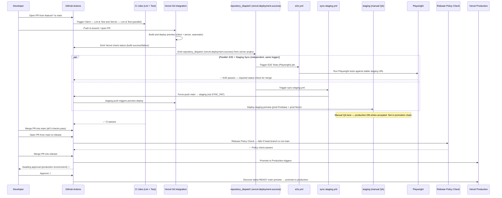

# GitHub Actions Deployment Pipeline

This repository uses a **3-branch lifecycle**: `feature/* → main → release` for the **automated promotion chain**, plus a `staging` branch as a parallel manual-QA lane auto-synced from `main`. No code reaches Vercel production without passing CI, E2E tests, and a human approval gate — the `staging` branch is not in this promotion chain. Preview deployments are handled by **Vercel's native Git integration** — every push to a branch or PR automatically creates a preview deployment without any GitHub Actions workflow involvement. E2E tests are triggered by the server's `repository_dispatch` event after each preview deployment, and merge to `main` is blocked until all required checks pass.

## 1. Pipeline Overview

## 2. Workflows

| Workflow file                   | Name                                 | Trigger                      | Purpose                                                                                                                                 |
| ------------------------------- | ------------------------------------ | ---------------------------- | --------------------------------------------------------------------------------------------------------------------------------------- |
| `ci.yml`                        | CI                                   | `pull_request` to `main`     | Lint + unit tests + client build verification                                                                                           |
| `e2e.yml`                       | E2E Tests (Playwright)               | `repository_dispatch (vercel.deployment.success)` + `workflow_dispatch` (manual) | Run E2E when the server project emits a deployment dispatch (the slower deployment, includes Neon DB seed). Tests target stable staging URLs (`vars.E2E_BASE_URL` / `vars.E2E_API_BASE_URL`). Manual `workflow_dispatch` runs use the same variables — no manual `base_url` input |
| `promote-to-production.yml`     | Promote to Production                | `push` to `release`          | Discover latest READY `main` preview → promote to production (approval-gated)                                                           |
| `release-policy-check.yml`      | Release Policy Check                 | `pull_request` to `release`  | Fails if PR head branch is not `main`                                                                                                   |
| `sync-staging.yml`              | Sync main → staging                  | `repository_dispatch (vercel.deployment.success)` | Force-push `main` to `staging` after every server deployment (unconditional). Uses `SYNC_PAT` to trigger Vercel redeploy. Staging previews use production Firebase + Neon for manual QA. |

> **Note:** Preview deployments are **not** managed by any GitHub Actions workflow. They are created automatically by Vercel's native Git integration whenever code is pushed to a branch or a PR is opened.

## 3. E2E Trigger and Target Detection

E2E tests are triggered by **`repository_dispatch (vercel.deployment.success)`** events via `e2e.yml`. When Vercel's native Git integration completes a Preview deployment, a `repository_dispatch` event is emitted. The workflow uses **project-name filtering** (not hostname pattern matching) to decide whether to run tests.

### How it works

1. **Trigger**: Only the **server** Vercel project has Repository Dispatch Events enabled (see [`VERCEL_SETTINGS.md`](VERCEL_SETTINGS.md) §1). The client project does not emit dispatch events.
2. **Filter**: The `e2e.yml` job has an `if` condition: `contains(github.event.client_payload.project.name || '', 'server')`. This is a safety guard — since only the server project emits dispatches, it effectively always passes for `repository_dispatch` events.
3. **Target URL**: Tests run against the stable staging client URL from `vars.E2E_BASE_URL` (a **GitHub Actions Variable**, not a secret), not the per-deployment hash URL from the dispatch payload. This avoids stale/cancelled deployment URLs.
4. **API URL**: The API base URL is read from `vars.E2E_API_BASE_URL` (also a GitHub Actions Variable).
5. **Client readiness**: After the server dispatch fires, the workflow polls `vars.E2E_BASE_URL` with `curl` to verify the client is also ready before starting Playwright. It then polls `/api/health` for **API + seed readiness** using the `seed.mode` field: `seeded` and `skipped` are terminal-ready states that allow tests to proceed; `failed` causes an immediate workflow failure; `in_progress` keeps polling until the timeout is reached.
6. **`workflow_dispatch`**: Manual/ad-hoc runs resolve targets from the same `vars.E2E_BASE_URL` and `vars.E2E_API_BASE_URL` variables — there is no `base_url` input. The only configurable inputs are `browser_profile` and `test_suite`.
7. **URL safety gate (production-host denylist)**: `e2e.yml` defines canonical denylist constants (`PRODUCTION_HOSTS_CLIENT`, `PRODUCTION_HOSTS_API`) as workflow-level `env` values. Before any test runs, a validation step hard-fails if: (a) a target hostname exactly matches a denylist entry, (b) a URL cannot be parsed, or (c) a denylist constant is empty/missing. Hostname comparison is exact match after lowercase normalization and port removal.

### Key details

- Only the server project emits `repository_dispatch` events, so the `E2E Tests (Playwright)` check is produced once per deployment cycle. The client project does not emit dispatches — no client-event skip path exists.
- Detection uses the `project.name` field from the dispatch payload as a safety guard, **not** hostname pattern matching or `VERCEL_PROJECT_ID_CLIENT`. A separate denylist validation step performs exact-hostname matching against production hosts as an additional safety gate.
- Non-sensitive config (`E2E_BASE_URL`, `E2E_API_BASE_URL`) uses **GitHub Actions Variables** (`vars.*`) so values are visible in logs and easy to verify. Credentials use **Secrets** (`secrets.*`).
- Workflow constants (`PRODUCTION_HOSTS_CLIENT`, `PRODUCTION_HOSTS_API` in `e2e.yml`) are the **canonical** source for the denylist. This document and other docs are **descriptive only**. Changes to the denylist require maintainer-reviewed PRs on `.github/workflows/e2e.yml`.
- Hostname matching semantics: URLs are parsed (via Python `urlparse`), ports are stripped, hostnames are lowercased, and comparison is exact string equality — no substring, glob, or regex matching.

## 4. E2E Troubleshooting

When investigating E2E check results, use this table to interpret the status:

| Check Status                                     | Meaning                                                                                                     | Action                                                                                                                          |
| ------------------------------------------------ | ----------------------------------------------------------------------------------------------------------- | ------------------------------------------------------------------------------------------------------------------------------- |
| **Passed**                                       | Playwright tests executed against stable staging URL and passed                                              | No action needed                                                                                                                |
| **Failed** — Playwright test failure             | Tests executed against the staging URL and failed                                                            | Check the Playwright HTML report artifact uploaded to the workflow run                                                          |
| **Failed** — readiness check timeout             | Client or API did not respond within the polling window, or `seed.mode` remained `in_progress` beyond the polling window | Check the readiness-check step logs for HTTP status codes, `seed.mode` values, and error details                                |
| **Failed** — denylist blocked                    | Target URL hostname matched a production denylist entry                                                      | Verify `vars.E2E_BASE_URL` and `vars.E2E_API_BASE_URL` point to staging/preview URLs, not production                           |
| **Failed** — seed mode `failed`                  | API is healthy but `seed.mode` is `failed` (permanent config error)                                          | Check server logs and Vercel Preview env vars for missing seed variables (`E2E_ADMIN_UID`, `E2E_ADMIN_EMAIL`)                   |
| **Cancelled**                                    | Workflow run was cancelled mid-execution                                                                     | Re-run the workflow or push a new commit to trigger a fresh deployment                                                          |

**First debugging step:** Open the workflow run for `e2e.yml` and review the step logs. Key diagnostic artifacts: the **Vercel payload dump** (shows project name, deployment URL, commit SHA), the **resolved staging URL**, the **seed.mode value** from the API readiness check, the **client readiness-check** and **API readiness-check** logs, and the uploaded **Playwright report** and **test results** artifacts.

## 5. Staging Branch — Manual QA Lane

### Purpose

`staging` is a long-lived parallel branch for manual QA with production credentials. It is **not** in the `main → release` promotion chain — production promotion still discovers the latest `main` preview. The `staging` branch exists so that team members can perform real-user QA (with production Firebase auth and production Neon data) without affecting the automated pipeline.

### Auto-sync mechanism

`sync-staging.yml` triggers on `repository_dispatch (vercel.deployment.success)` from the server project — the **same event** that triggers `e2e.yml`. Both workflows run in parallel and are completely independent. The sync is **unconditional**: it fires regardless of whether E2E tests pass or fail. It force-pushes `main` to `staging`, so `staging` is always an exact copy of `main`.

### Environment

`staging` Vercel previews use **production Firebase credentials** (real user login) and the **production Neon connection string** (`DATABASE_URL` = production) via branch-scoped environment variable overrides in both Vercel projects. `SKIP_E2E_SEED=true` prevents automated E2E seed injection on the staging deployment. See [`VERCEL_SETTINGS.md`](VERCEL_SETTINGS.md) §6 for the full branch-scoped override configuration.

### E2E isolation

E2E targets (`vars.E2E_BASE_URL`, `vars.E2E_API_BASE_URL`) remain pointed at ephemeral preview URLs — **never** at the `staging` URL. The staging and E2E environments are completely separate: different URLs, different database connections (staging uses production Neon; E2E uses ephemeral Neon branches), and different Firebase credentials.

### Accepted risk

Manual QA actions on `staging` write to the **production Neon database**. This is explicitly accepted — the staging environment is designed for real-user validation with real data. Test records created during QA can be cleaned up manually via the admin dashboard or database console.

---

## 6. One-Time Setup — GitHub

Full GitHub repository settings — secrets, environments, branch protections, auto-merge, and fork policy — are documented in [`GITHUB_SETTINGS.md`](GITHUB_SETTINGS.md). Follow that guide from top to bottom for initial setup or to verify an existing configuration.

### Required secrets summary

Kept here for quick reference. [`GITHUB_SETTINGS.md`](GITHUB_SETTINGS.md) is the authoritative source.

#### CI and E2E secrets (8)

| Secret                                                    | Purpose                                                        |
| --------------------------------------------------------- | -------------------------------------------------------------- |
| `E2E_ADMIN_EMAIL` / `E2E_ADMIN_PASSWORD`                  | Admin test account                                             |
| `E2E_USER_EMAIL` / `E2E_USER_PASSWORD`                    | Regular user test account                                      |
| `E2E_SUPER_ADMIN_EMAIL` / `E2E_SUPER_ADMIN_PASSWORD`      | Super-admin test account                                       |
| `FIREBASE_API_KEY`                                         | Firebase API key for E2E auth (fallback: `VITE_FIREBASE_API_KEY`) |
| `VERCEL_AUTOMATION_BYPASS_SECRET`                          | Vercel Deployment Protection bypass for E2E automation         |

E2E test data is seeded automatically by the preview server on startup — no seeding secrets needed in GitHub Actions.

These secrets are sufficient for CI, E2E, and preview deployments. Preview deployments are handled entirely by Vercel's native Git integration — no Vercel API tokens or project IDs are needed.

> **Managing E2E secrets:** The provisioning script is a **local/manual admin tool** run from a developer's machine. Neither `ci.yml` nor `e2e.yml` execute it — they consume the synced outputs. The canonical way to manage these secrets is through the provisioning script and `.env.e2e` file. Copy `.env.e2e.example` to `.env.e2e`, fill in email/password fields, and run `node scripts/provision-e2e-firebase-users.js`. The script provisions Firebase users, writes UIDs back to `.env.e2e`, and syncs the correct subset of values to GitHub Actions secrets (emails + passwords) and Vercel Preview env vars (emails + UIDs). For sync-only (skip Firebase provisioning): `node scripts/provision-e2e-firebase-users.js --sync-only`.
>
> **Important:** Vercel Preview environment variable changes only take effect on **new preview deployments**. After syncing, trigger a new preview deployment or redeploy an existing one for the changes to be picked up.
>
> **Environment note:** The provisioning script depends on local CLI installation/PATH, `gh` and `vercel` CLI auth state, `server/.vercel/project.json` linkage, and local `.env.e2e`/`server/.env` files. Different terminals, shell sessions, or machines may produce different results. If you encounter terminal-related errors, check: (1) `.env.e2e` exists and has the required fields populated (copy from `.env.e2e.example`), (2) `server/.env` exists with Firebase admin credentials (needed unless running `--sync-only`), (3) you are in the repo root, (4) `gh auth status`, (5) `vercel whoami`, (6) `cd server && vercel link`.

#### Production promotion secrets (4)

| Secret                     | Purpose                                                                                    |
| -------------------------- | ------------------------------------------------------------------------------------------ |
| `VERCEL_TOKEN`             | Vercel API token — used by `promote-to-production.yml`  |
| `VERCEL_ORG_ID`            | Vercel team/org ID — used by `promote-to-production.yml` |
| `VERCEL_PROJECT_ID_CLIENT` | Vercel project ID for the client app — used by `promote-to-production.yml` |
| `VERCEL_PROJECT_ID_SERVER` | Vercel project ID for the server app — used by `promote-to-production.yml` |

These 4 secrets are **required** for production promotion via GitHub Actions. Without them, merging into `release` will trigger `promote-to-production.yml` which will fail. If you prefer to promote manually via the Vercel dashboard, you can omit these secrets.

#### Staging sync secret (1)

| Secret                     | Purpose                                                                                    |
| -------------------------- | ------------------------------------------------------------------------------------------ |
| `SYNC_PAT`                 | Personal Access Token with `contents: write` scope — required by `sync-staging.yml` to push to `staging` in a way that triggers Vercel's native Git integration. Pushes via `GITHUB_TOKEN` do not trigger Vercel redeployments. |

### Required checks per branch

| Target branch | Required status checks                                                                                                               |
| ------------- | ------------------------------------------------------------------------------------------------------------------------------------ |
| `main`        | `Client — Lint & Test`, `Server — Lint & Test`, `<your-client-vercel-check>`, `<your-server-vercel-check>`, `E2E Tests (Playwright)` |
| `release`     | `Release Policy Check` + require a pull request before merging                                                                       |
| `staging`     | **None** — intentionally unprotected. Auto-managed by `sync-staging.yml` (force-push from `main`). Not a merge target for PRs.       |

> **Note:** The `E2E Tests (Playwright)` check name is produced by `e2e.yml` (job name: `E2E Tests (Playwright)`). The Vercel checks are produced by Vercel's native Git integration — **their exact names depend on your Vercel project names** (e.g., `Vercel – ichnos-protocol`, `Vercel – ichnos-protocol-server`). To find the correct names: open a recent PR, scroll to the status checks section, and copy the exact Vercel check context strings. A mismatch between the configured required check name and the actual check context will block all merges. GitHub Actions check names are frozen in workflow file headers — do not rename jobs without updating branch protection rules. See [`GITHUB_SETTINGS.md`](GITHUB_SETTINGS.md) §4 for step-by-step configuration.

## 7. One-Time Setup — Vercel

Full Vercel project settings — production branch, environment variables, old alias cleanup, and token/ID lookup — are documented in [`VERCEL_SETTINGS.md`](VERCEL_SETTINGS.md). Follow that guide for both `ichnos-client` and `ichnos-protocolserver`.

Two critical invariants to maintain:

- **Vercel production branch must be `release`** on both projects (not `main`).
- **Vercel Git integration must remain enabled** — preview deployments are created automatically on branch pushes and PRs. This is the default Vercel behavior; do not add `"git": { "deploymentEnabled": false }` to `vercel.json` files.

## 8. Daily Developer Workflow

### Feature → main (PR-gated)

| Step | Action                                                                                               | Status                                |
| ---- | ---------------------------------------------------------------------------------------------------- | ------------------------------------- |
| 1    | Create `feature/<name>` from `main`; open PR targeting `main`                                        | 🔴 Manual                             |
| 2    | CI runs: lint + test + build (client and server)                                                     | ✅ Automated                          |
| 3    | Vercel automatically creates preview deployments for both client and server                          | ✅ Automated (native Git integration) |
| 4    | Server project emits `repository_dispatch (vercel.deployment.success)`; `e2e.yml` runs `E2E Tests (Playwright)` | ✅ Automated                          |
| 5    | All 5 required checks pass — PR is mergeable                                                         | ✅ Automated gate                     |
| 6    | Merge PR into `main`                                                                                 | 🔴 Manual                             |

### main → release (production promotion)

| Step | Action                                                                                 | Status                                    |
| ---- | -------------------------------------------------------------------------------------- | ----------------------------------------- |
| 7    | Open PR from `main` to `release`                                                       | 🔴 Manual                                 |
| 8    | `Release Policy Check` runs — fails if head branch is not `main`                       | ✅ Automated gate                         |
| 9    | Merge PR into `release`                                                                | 🔴 Manual                                 |
| 10   | `Promote to Production` triggers; GitHub pauses for `production` environment approval  | ✅ Automated trigger / 🔴 Manual approval |
| 11   | Approve → workflow discovers latest READY `main` preview and promotes it to production | 🔴 Manual approval → ✅ Automated         |

## 9. Vercel Quota Protection

Preview deployments are managed by Vercel's native Git integration, which builds on every push. E2E tests run against the stable staging URLs from `vars.E2E_BASE_URL` and `vars.E2E_API_BASE_URL` (not per-deployment hash URLs), so no extra Vercel build is triggered for testing.

Fork PRs do not receive preview deployments with secrets because Vercel's Git integration does not expose environment variables to builds from forks by default.

## 10. Rollback

### Option A — Revert through the pipeline

Revert the bad commit on `main`, open a new `main → release` PR, and promote through the normal pipeline.

### Option B — Via Vercel dashboard

1. Open **Vercel Dashboard → Project → Deployments**.
2. Find the previous production deployment.
3. Click **Promote to Production** directly in the UI.

Repeat for both `ichnos-client` and `ichnos-protocolserver`. No GitHub Actions run is required.
